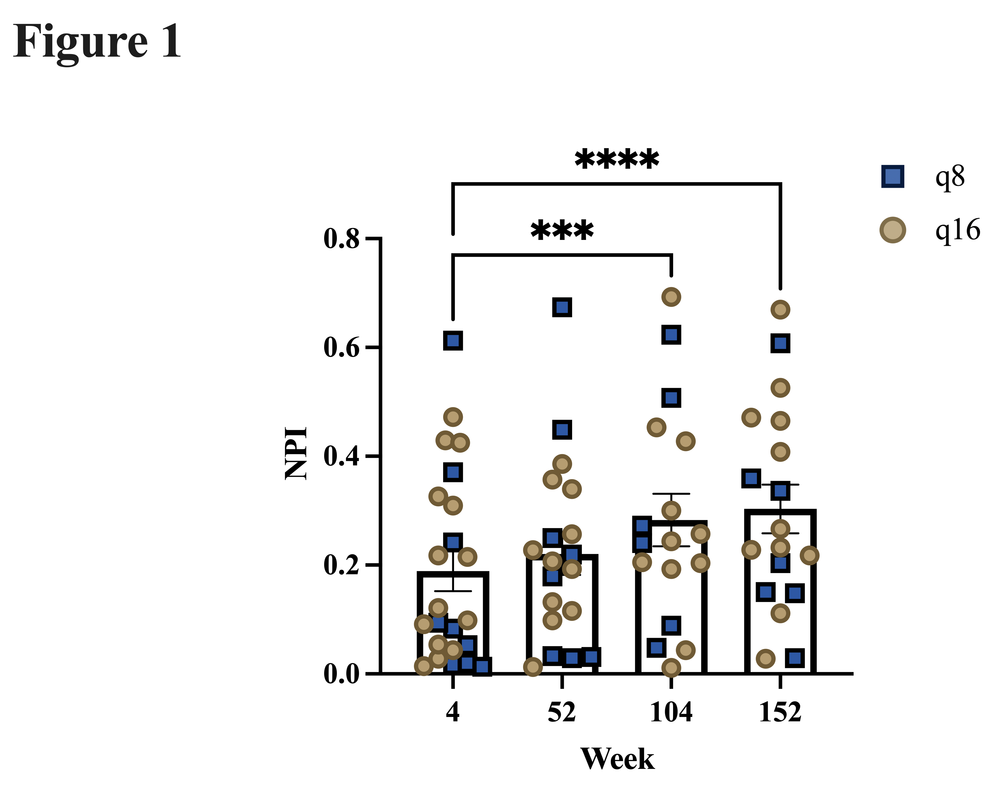
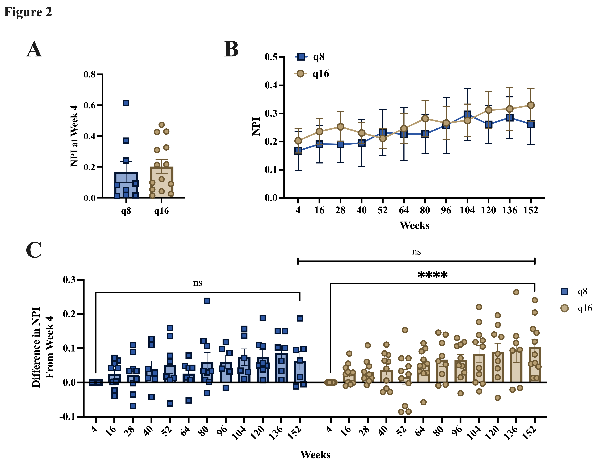
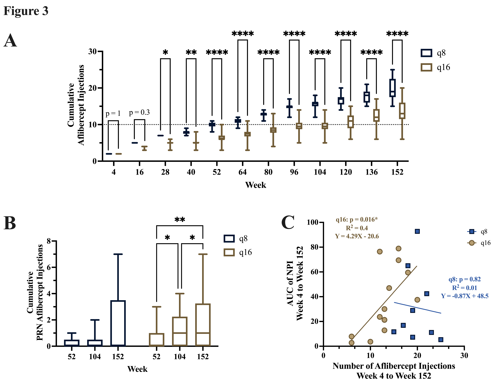
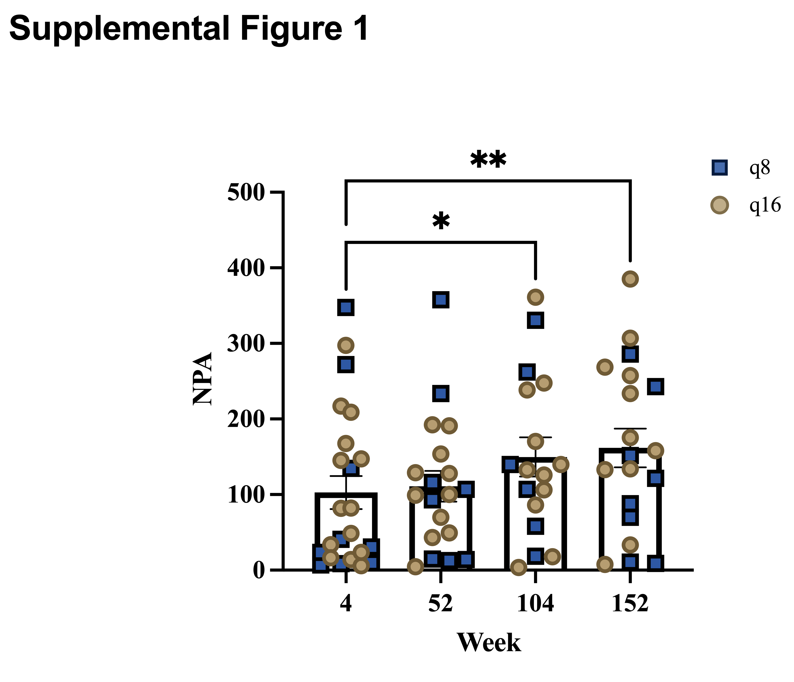

# Endolaserless Analysis

## Repository Summary

This repository contains analysis code for the **Laserless Study (NCT02976012)**, a prospective randomized trial of aflibercept monotherapy after endolaserless vitrectomy for proliferative diabetic retinopathy (PDR)-related vitreous hemorrhage. 

We processed and analyzed ultra-widefield fluorescein angiography (UWFA) images graded by the Wisconsin Reading Center to quantify the non-perfusion index (NPI) over 3 years in eyes randomized to q8-week versus q16-week intravitreal aflibercept injection schedules.

## Citation

**Primary Reference** (\* authors contributed equally)

Qin LG*, **Camarda ND\***, Kasetty VM, Starnes DC, Sood N, Blodi BA, Marcus DM. *Ultra-wide field fluorescein angiographic retinal nonperfusion grading in eyes receiving aflibercept monotherapy after endolaserless vitrectomy for proliferative diabetic retinopathy-related vitreous hemorrhage.* Submitted to RETINA: The Journal of Retinal and Vitreous Diseases (March 2025).

## Key Findings

The analysis code supports the following key findings:

- **NPI progression**: Retinal nonperfusion increased significantly over 3 years despite anti-VEGF therapy
- **Treatment frequency effect**: Eyes treated q16 weeks showed significant NPI progression, while q8-week eyes did not
- **Rescue injections**: The q16 group required more unscheduled (PRN) rescue aflibercept injections, yet still progressed
- **Association with injection burden**: In the q16 group, higher cumulative injections were positively associated with greater NPI burden; no such association was seen in the q8 group

The analysis highlights that more frequent, earlier anti-VEGF dosing may slow progression of retinal ischemia compared to extended dosing, with implications for future long-acting anti-VEGF therapies.

## Repository Structure

```
endolaserless_analysis/
├── scripts/
│   ├── count_prn_injections.R          # PRN injection analysis and counting
│   ├── endolaserless_analysis-2.R      # Main NPI analysis script
│   └── helper_scripts.R                # Utility functions and helper code
├── docs/                               # PNG figure files for GitHub display
│   ├── Figure1.png                     # Figure 1 - NPI changes over time
│   ├── Figure2.png                     # Figure 2 - NPI increases in q16 group
│   ├── Figure3.png                     # Figure 3 - Treatment load and PRN injections
│   └── SupplementalFigure1.png         # Supplemental Figure 1 - NPA changes
├── data/                               # Input data files (NOT committed to repository)
│   ├── 2024-10-22 Endolaserless_RedCap_Data.xlsx    # Initial analysis data (NOT committed to repository)
│   ├── prn_injections.xlsx
│   └── Stats Wisconsin (Nick Edited).xlsx
├── processed_data/                      # Processed analysis data (NOT committed to repository)
│   └── npi_project/
│       └── output-week4_baseline/
│           ├── cached_long_input_data.xlsx
│           └── cached_wide_input_data.xlsx
├── npi_project/
│   ├── prism_output/                   # Prism-generated figures and visualizations
│   │   ├── Final/                      # Final publication figures (TIFF format)
│   │   └── [other analysis plots]
│   └── output/                         # Analysis output files (NOT committed to repository)
│       ├── count_prn_injections/       # PRN injection analysis outputs
│       ├── output-week4_week16_baseline/ # Main analysis outputs
│       └── [various Excel output files]
├── README.md                           # This file
└── .gitignore                          # Git ignore rules
```

**Note:** Data directories (`data/`, `processed_data/`, `npi_project/output/`) are excluded from the repository for privacy and size considerations. Users should create these directories and add their own data files when running the analysis scripts.

## Prism Output Figures

All visualizations were created using **GraphPad Prism**. The following key figures are included in this repository:

### Final Publication Figures



**Figure 1. Combined q8 and q16 treatment schedules data shows that NPI increase over time despite intravitreal aflibercept monotherapy.**

Bar graphs showing nonperfusion index (NPI) changes over time. Blue squares represent q8 (N=9) group patients. Orange circles represent q16 (N=14) group patients. Statistics using mixed effects model with Dunnett posttest and comparisons to week 4. ***p<0.001**, **p<0.0001**. Error bars, mean ± SEM.



**Figure 2. In q16 treatment schedule but not q8, NPI increases significantly from baseline.**

(A) Bar graphs showing baseline non-perfusion index (NPI) at week 4 for q8 (N=9) and q16 (N=14) treatment schedules. Unpaired Student's T-test. p=ns. (B) Timeline graph showing raw NPI and (C) bar graph showing the change in NPI from week 4 baseline at each follow-up appointment stratified by treatment group. Statistics using mixed effects model with Tukey posttest and all multiple comparisons. **p<0.0001**. Error bars, mean ± SEM. 



**Figure 3. Decreased treatment load and later PRN injections are insufficient to prevent RNP progression.**

Box-and-whisker plots displaying the (A) cumulative total and (B) cumulative PRN (non-scheduled) intravitreal aflibercept injections received at each timepoint stratified by q8 (N=9) and q16 (N=14) treatment groups. Box-and-whisker plot shows the median (line inside the box), interquartile range (box), and whiskers representing 1.5 times the interquartile range. Dotted horizontal line in (A) indicates 10 cumulative injections. Statistics using two-way repeated measures ANOVA with (A) Holm-Sidak posttest and comparisons between treatment schedules at each timepoint and (B) Tukey posttest and all multiple comparisons.(C) Scatter plot showing the total number of injections versus the area under the curve (AUC) of nonperfusion index (NPI) from baseline week 4 to week 152 for each subject stratified by treatment group. Statistics using simple linear regression with p-value representing the result of F-test for non-zero slope.  **p<0.05**, **p<0.01**, ***p<0.001**, **p<0.0001**. Error bars, mean ± SEM. 

### Supplementary Figures



**Supplementary Figure 1. Combined q8 and q16 treatment schedules data shows that NPA increase over time despite intravitreal aflibercept monotherapy.**

Bar graphs showing nonperfusion area (NPA) changes over time. Blue squares represent q8 (N=9) group patients. Orange circles represent q16 (N=14) group patients. Statistics using mixed effects model with Dunnett posttest and comparisons to week 4. **p<0.05**, **p<0.01**. Error bars, mean ± SEM.

## Usage

1. **Setup**: Ensure R is installed with required packages (see script headers for dependencies)
2. **Data Preparation**: Place required data files in the appropriate directories
3. **Run Analysis**: Execute scripts in order:
   - `endolaserless_analysis-2.R` - Main analysis pipeline
   - `count_prn_injections.R` - PRN injection analysis
4. **Output**: Results are saved to `npi_project/output/` directory

## Dependencies

The analysis scripts require several R packages including:
- `tidyverse` for data manipulation
- `lme4` and `lmerTest` for mixed effects modeling
- `ggplot2` and `ggprism` for plotting
- `openxlsx` for Excel file handling
- Additional statistical packages as specified in script headers

## Citation

If you use this analysis code, please cite the original study:
**Laserless Study (NCT02976012)** - A prospective randomized trial of aflibercept monotherapy after endolaserless vitrectomy for proliferative diabetic retinopathy (PDR)-related vitreous hemorrhage.

## License

This repository contains research analysis code. Please contact the authors for usage permissions.
